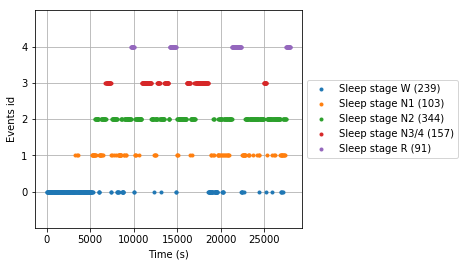
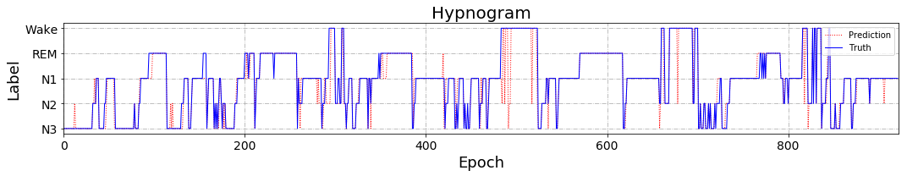
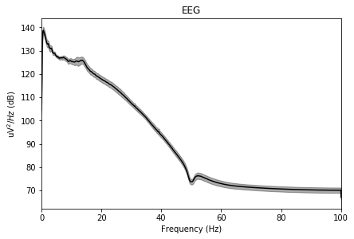
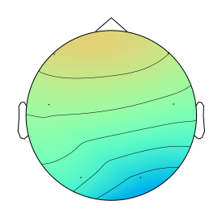

## Signal Processing Tool

Using [MNE](https://github.com/mne-tools/mne-python), an open-source Python package for exploring, visualizing, and analyzing human neurophysiological data, to analysis the PSG data for sleep staging.

Here are some examples on ISRUC dataset.

### Sleep stages distribution visualization

(1) Visualization of subject's sleep stages by MNE.

```python
import os
import mne # Version: 0.17.0
import numpy as np
from mne.time_frequency import psd_welch
import matplotlib.pyplot as plt

# Load preprocessed data from .npy file
# data shape: (nEpoch, nChannels, timeLen)
# label shape: (nEpoch, )
# label: 0 -> W stage, 1 -> N1 stage, 2 -> N2 stage, 3 -> N3/N4 stage, 4 -> REM stage
pData = os.path.join('data', 'subject1.npy'.format(sub_id))
pLabel = os.path.join('data', 'y_true.npy')
pPred = os.path.join('data', 'y_pred.npy')

data = np.load(pData)
label = np.load(pLabel) - 1
y_pred = np.load(pPred) - 1

# Set the params according to the data
freq = 200
epoch_len = 30

event_id = {
    'Sleep stage W': 0,
    'Sleep stage N1': 1,
    'Sleep stage N2': 2,
    'Sleep stage N3/4': 3,
    'Sleep stage R': 4
}

# Construct events array
events = [[i * freq * epoch_len, 0, int(j)] for i, j in zip(range(len(label)), label)]

# Plot events
mne.viz.plot_events(events, event_id=event_id, sfreq=freq)
```



(2) Plot the hypnogram using `matplotlib`. 

```python
import matplotlib.pyplot as plt

def plotHypnogram(y_true, y_pred, title='', file_name='hypnogram', save=False):
    y_true += 1
    y_pred += 1
    
    fig = plt.figure(figsize=(15,3))

    figdata=y_pred
    plt.plot(figdata, linewidth=1, color='r', linestyle=':', label='Prediction')

    plt.xlim(0,len(figdata))
    plt.yticks(np.arange(1,6), ['N3', 'N2', 'N1','REM','Wake'])
    plt.tick_params(labelsize=14)

    plt.ylabel('Label', fontsize=18)
    plt.xlabel('Epoch', fontsize=18)
    plt.grid(True, linestyle='-.')

    figdata=y_true
    plt.plot(figdata, linewidth=1, color='b', label='Truth')
    plt.title(title, fontsize=20)
    plt.legend(loc=1)

    plt.tight_layout()
    if save:
        plt.savefig(file_name + '.pdf')
    plt.show()
    
plotHypnogram(label, y_pred, title=f"Hypnogram")
```

The blue line is the ground truth while the red line is the prediction of model. 



### PSD extraction and visualization

Extracting and visualizing the frequency domain feature power spectral density (PSD) in EEG signals.

```python
# Enter the channel name and the channel type to help the MNE initialize information

ch_nameslist = [
    'F3_A2', 'C3_A2', 'O1_A2', 'F4_A1', 'C4_A1', 'O2_A1', 
    'ROC_A1', 'LOC_A2',
    'X1','X2','X3'
]
ch_types = ['eeg'] * 6 + ['eog'] * 2 + ['emg'] * 3

# Range of frequency bands
FREQ_BANDS = [
    {'name': 'Delta', 'fmin': 0, 'fmax': 3.75},
    {'name': 'Theta', 'fmin': 3.75, 'fmax': 8.5},
    {'name': 'Alpha', 'fmin': 8.5, 'fmax': 13.5},
    {'name': 'Beta',  'fmin': 13.5, 'fmax': 30.5},
    {'name': 'Gamma',  'fmin': 30.5, 'fmax': 64}
]

info = mne.create_info(ch_names=ch_nameslist, ch_types=ch_types, sfreq=200)

# Construct Epoch objects
epochs = mne.EpochsArray(data, info=info, events=events, event_id=event_id)
# Extract PSD features through Welch's method
psds, freqs = psd_welch(epochs, fmin=0, fmax=100, n_jobs=8)
# Normalize the PSDs
psds /= np.sum(psds, axis=-1, keepdims=True)

X = []
for band in FREQ_BANDS:
    psds_band = psds[:, :, (freqs >= band['fmin']) & (freqs < band['fmax'])].mean(axis=-1)
    X.append(psds_band.reshape(len(psds), -1))
    
psds_bands = np.array(X)
epochs.plot_psd() # Plot PSD
```



### Plot topographic map of PSD

(1) Plot topographic map of PSD feature from a specific band and epoch.

```python
ch_nameslist = ['F3', 'C3', 'O1', 'F4', 'C4', 'O2'] # EEG channels
montage = mne.channels.read_montage(kind='standard_1020',ch_names=ch_nameslist)
pos = montage.get_pos2d()

band = 0
epoch = 0

im, _ = mne.viz.plot_topomap(
    psds_bands[band, epoch, :], 
    pos, 
    vmin=0, 
    vmax=psds_bands.max(), 
    cmap = plt.cm.rainbow, 
    image_interp='spline16'
)
```



(2) Plot topographic maps of specific frequency bands over time.

```python
import imageio
import PIL

img_list = []
for epoch in range(psds_bands.shape[1]):
    print(epoch)
    im, _ = mne.viz.plot_topomap(psds_bands[band, epoch, :], pos, vmin=0, vmax=0.2, cmap=plt.cm.rainbow, image_interp='spline16', show=False)
    im.figure.canvas.draw()
    data = np.frombuffer(im.figure.canvas.tostring_rgb(), dtype=np.uint8)
    w, h = im.figure.canvas.get_width_height()
    im.figure.clear()
    img = data.reshape((int(h), int(w), -1))
    img = PIL.Image.fromarray(img)
    img_list.append(img)
   
imageio.mimsave("PSD_Trans.gif", img_list, fps=5)
    
```

